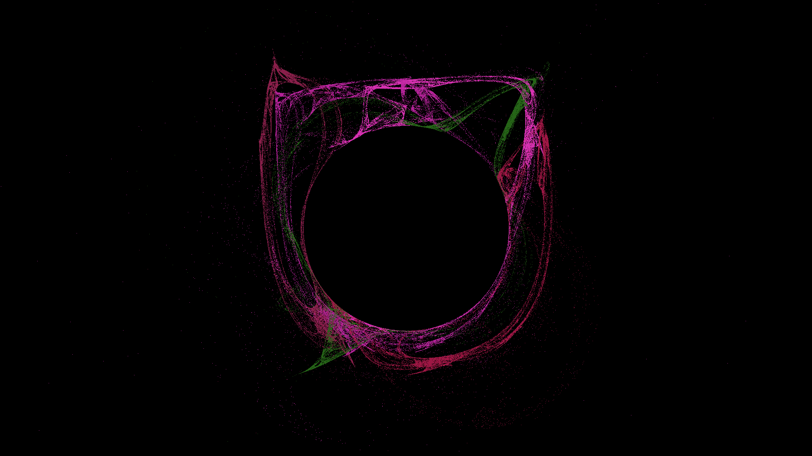
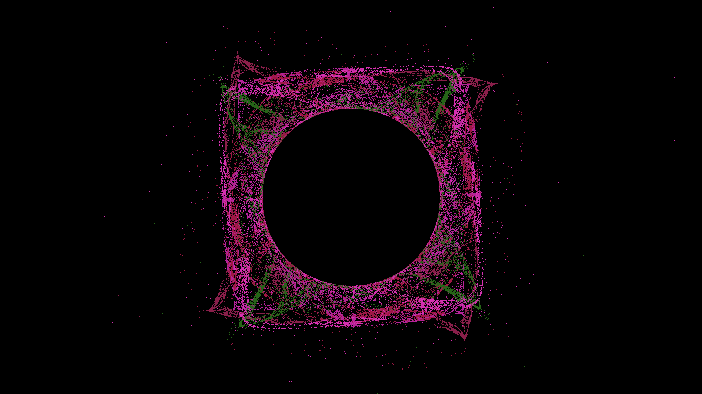
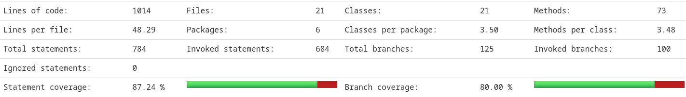

## Проект 4: фрактальное пламя

### Описание

Необходимо реализовать программу, которая позволит генерировать
изображения фрактального пламени на основе идеи Chaos Game.

### Функциональные требования

* Решение должно предоставлять два варианта работы - однопоточный и многопоточный;
* Решение должно реализовывать цветной алгоритм генерации;
* В решении должно быть заложено минимум 4 трансформации из [приложенной статьи](https://flam3.com/flame_draves.pdf);
* В решении должны быть представлены следующие параметры генерации и работы:
    * Размер итогового изображения;
    * Количество итераций;
    * Набор трансформационных функций:
        * Вариант функции;
        * Параметры функции;
    * Путь для сохранения изображения;
    * Количество потоков;
* Решение должно поддерживать несколько вариантов ввода параметров, такие как:
    * Консольный ввод;
    * JSON-файл конфигурации;
    * Параметры по дефолту;
* Решение должно валидировать входные параметры и сообщать в консоль об ошибках;
* Результатом работы решения должно быть изображение в формате PNG, в цветовом диапазоне RGB, 8 бит на канал;

### Нефункциональные требования

* Время выполнения решения в многопоточном режиме должно быть меньше работы в однопоточном;
* Конфигурация решения должна быть простой и интуитивно понятной;
* В случае возникновения ошибки, решение должно вывести корректное описание исключения и где оно возникло;
* Прогресс работы решения должен описываться в логах;
* Логи решения должны содержать прогресс выполнения (например, процент/часть выполненных итераций), сообщения об ошибках и предупреждения. Избегайте избыточного вывода (например, логирование при генерации каждой точки);

### Описание входных и выходных данных

В качестве входных данных ожидается увидеть следующие параметры:
* `-w`/`--width` - int, ширина итогового изображения, по дефолту - `1920`;
* `-h`/`--height` - int, высота итогового изображения, по дефолту - `1080`;
*  `--seed` - long, начальное значение генератора, по дефолту - `5`;
* `-i`/`--iteration-count` - int, количество итераций генерации, по дефолту - `2500`;
* `-o`/`--output-path` - строка, относительный путь до файла, в который нужно записать изображение в формате `PNG`, по дефолту - `result.png`;
* `-t`/`--threads` - int, количество потоков, по дефолту - `1`;
* `-ap`/`--affine-params` - конфигурация аффинных преобразований, строка формата `<a_1>,<b_1>,<c_1>,<d_1>,<e_1>,<f_1>/<a_N>,<b_N>,<c_N>,<d_N>,<e_N>,<f_N>`, где:
* `a` - масштаб/вращение X, double, например - `0.1`;
* `b` - сдвиг-смешивание X от Y, double, например - `0.1`;
* `c` - сдвиг по X, double, например - `0.1`;
* `d` - смешивание Y от X, double, например - `0.1`;
* `e` - масштаб/вращение Y, double, например - `0.1`;
* `f` - сдвиг по Y, double, например - `0.1`;
* `\` - разделитель каждого из элементов массива преобразований;
* `-f`/`--functions` - строка, конфигурация применяемых методов трансформации формата `<функция_N>:<вес_функции>,<функция_N>:<вес_функции>`, например - `swirl:1.0,horseshoe:0.8`, где:
* `<функция_N>` - название функции, например, `swirl`;
* `<вес_функции>` - вес применяемой трансформации/функции, double, например - `1.0`;
* `--config` - строка, относительный путь до файла конфигурации (необязательный);

Пример запуска:

```shell
sbt "run --seed 32.123531 -i 5000 -f swirl:1.0,horseshoe:0.8 -t 2"
```

Так же входные параметры можно представить в виде JSON файла `config.json`:

```json
{
  "size": {
    "width": 1920, 
    "height": 1080
  },
  "iteration_count": 2500,
  "output_path": "result.png",
  "threads": 4,
  "seed": 2.1324512,
  "functions": [
    {
      "name": "swirl",
      "weight": 1.0
    },
    {
      "name": "horseshoe",
      "weight": 0.7
    }
  ],
  "affine_params": [
    {
      "a": 1.0,
      "b": 1.0,
      "c": 1.0,
      "d": 1.0,
      "e": 1.0,
      "f": 1.0
    },
    {
      "a": 0.3,
      "b": 1.0,
      "c": -0.2,
      "d": 0.4,
      "e": 1.0,
      "f": 1.0
    }
  ]
}
```

Пример запуска через CLI с конфигом:

```shell
sbt "run --config config.json"
```

Приоритет параметров следующий:
* Консольный ввод;
* JSON-файл;
* Параметры по дефолту;

### Тестирование

* Предоставьте результаты замеров времени выполнения для 1, 2, 4, 8 потоков при фиксированных параметрах. Сравните с однопоточной версией;
* Для каждой из трансформаций реализуйте тесты, которые проверят корректность изменений;
* Проверьте, что приложение корректно обрабатывает разные варианты конфигурации;

Каждый модуль решения должен быть покрыт юнит-тестами для валидации корректной работы кода. Минимальный уровень покрытия
кода тестами - 80%.

Примеры тестов реализации:
* Unit-тест для каждой из трансформаций, проверяющий корректность вычисления координат и весов;
* Benchmark тест для однопоточной и многопоточной вариаций работы - для сравнения производительности реализации при разных количествах потоков;
* Unit-тест для парсера входных параметров, JSON конфигурации;
* Unit-тест, проверяющий корректность итога работы решения (проверка изображения на соответствие изначальной конфигурации);

### Ограничения и советы

* Убедитесь, что начальная реализация программы работает корректно, прежде чем переходить к многопоточности;
* Используйте профилировщик или отладочные замеры скорости для поиска узких мест;
* Старайтесь разбивать логику на мелкие и независимые вызовы, которые, при необходимости, можно будет переиспользовать. Такой подход облегчит как разработку, так и тестирование;

**Рекомендации к реализации**:

1. Реализуйте логику рендера изображения для однопоточной работы;
2. Добавьте поддержку нескольких трансформаций;
3. Реализуйте поддержку парсинга CLI аргументов и JSON конфигурации;
4. Реализуйте механизм многопоточной обработки;
5. Добавьте тесты для вашего кода;
6. Оптимизируйте логику, проверьте корректность рендера для разных трансформаций;

### Дополнительные материалы

* Описание фрактального пламени:
    * https://en.wikipedia.org/wiki/Fractal_flame
    * https://habr.com/ru/articles/251537
* [Оригинальная статья](https://flam3.com/flame_draves.pdf);
* Что такое Chaos Game:
    * https://en.wikipedia.org/wiki/Chaos_game
    * https://beltoforion.de/en/recreational_mathematics/chaos_game.php
* [Описание СИФ с нуля](https://proproprogs.ru/fractals);
* [Онлайн демо](https://tariqksoliman.github.io/Fractal-Inferno)

### Сроки и процедура сдачи ДЗ

На реализацию проекта отводится весь модуль.

По завершению модуля ассистент имеет полное право выставить 0 баллов за работу, если она не была предоставлена в срок.

Доработка ДЗ по замечаниям возможна до дедлайна. Доработка ДЗ после дедлайна согласуется с ассистентом,
после доработки количество баллов может быть увеличено.
В ответ на задание нужно прислать кликабельную ссылку на репозиторий.

Больше подробностей по сдаче ДЗ можно найти в разделе "Информационный блок".

### Критерии оценки

За задание можно получить 120 баллов, а также бонусные баллы:
1. +10 бонусных баллов, если реализуете 5 и более трансформаций;
2. +10 бонусных баллов, если реализуете поддержку логарифмической гамма-коррекции (описано в [статье](https://flam3.com/flame_draves.pdf)):
* Добавлено поле `gamma_correction` в JSON-конфиг, добавлен параметр `-g`/`--gamma-correction` для CLI:
* Булевое значение, которое включает или выключает гамма-коррекцию;
* В случае включения коррекции, яркость пикселей преобразуется по следующей формуле:
* `color = pow(color, 1.0 / gamma)`, где `gamma` - либо равна `2.2` (значение по умолчанию), либо берется из конфигурации;
* Добавлено поле `gamma` в JSON-конфиг, добавлен параметр `--gamma` для CLI:
* Число с плавающей точкой, определяет значение гаммы для коррекции яркости итогового изображения;
* При наличии параметра в конфигурации, соответствующая логика должна применяться на процесс рендера;
3. +10 бонусных баллов, если вы добавите поддержку симметрии в генерации пламени (описано в [статье](https://flam3.com/flame_draves.pdf)):
* Добавлено поле `symmetry_level` в JSON-конфиг, добавлен параметр `-s`/`--symmetry-level` для CLI:
* Целое число (N >= 1), которое задает количество поворотов вокруг центра;
* Каждая точка дублируется N раз с поворотом на 360/N градусов;
* При наличии параметра в конфигурации, соответствующая логика должна применяться на процесс рендера;
4. +10 бонусных баллов, если вы поделитесь вашим результатом в чате группы и вам поставят лайк;

Дополнительно можно получить личные бонусные баллы на усмотрение ассистента.

Так же можно получить до 18 баллов сверху за проведение кросс-ревью.
Бонус за кросс-ревью начисляется за качественное и своевременное выполнение ревью.

Детали о снятии обычных и начислении бонусных баллов можно найти в разделе "Информационный блок".

### Примеры работ

* [Пример 1](https://www.chaoticafractals.com/art/chaosfissure)
* [Пример 2](https://github.com/alexnardini/FLAM3_for_SideFX_Houdini)

### Ограничения по code style

Ниже приведены ограничения, которые **вы должны соблюдать при написании ДЗ**. Часть правил реализована автоматически за
счёт линтеров кода, но мы могли что-то не предусмотреть, и если вы успешно сдадите ДЗ, при этом, нарушив, правила, то
**можем вам снизить баллы за ДЗ**.

* Переменные и функции должны иметь осмысленные названия;
* Использовать java коллекции запрещается (используйте `Scala` коллекции);
* Использовать scala `mutable` коллекции запрещается (используйте `immutable` коллекции);
* Использовать `var` запрещается (используйте `val`);
* Использование `this` запрещается (используйте `self`, если надо);
* Использование `throw` запрещается (используйте `Either` или `Option`);
* Использование `try` запрещается (используйте `Either` или `ApplicativeError`);
* Использование `null` запрещается (используйте `Option`);
* Использование `return` запрещается;
* Использование `System.exit` запрещается;
* Касты или проверки на типы с помощью методов из Java вроде `asInstanceOf` запрещаются;
* Использование циклов запрещается (используйте `for comprehension`, `tailRec`, или методы коллекций `fold`/`foldLeft`/
  `reduce`/ `map`/ `filter`);
* Использование `foreach` (аналогично предыдущему пункту);
* Использование небезопасных вызовов разрешено только в тестах (например: `.get` у `Option`, `.head`, обращение по
  индексу);
* Использование `require` / `assert` для ошибок запрещается (используйте `shouldBe` из scalatest и его вариации);
* Использование аннотаций запрещается (кроме `@tailrec`);

## Структура проекта

```text
├── project
│   ├── build.properties    - версия sbt
│   └── plugins.sbt         - плагины для sbt
├── src
│   ├── main
│   │   └── scala
│   │      └── tbank.academy.scala.fractals
│   └── test
│       └── scala
│          └── tbank.academy.scala.fractals
...
├── .gitlab-ci.yml  - конфигурация пайплайна
├── .sbtopts        - опции jvm для sbt
├── .scalafix.conf  - конфигурация линтеров
├── .scalafmt.conf  - конфигурация форматирования кода
├── build.sbt       - конфигурация проекта
└── README.md       - Условия ДЗ
```

---

# Выполнено

- [x] Запуск в однопоточном режиме
- [x] Запуск в многопоточном режиме
- [x] +10 бонусных баллов, если реализуете 5 и более трансформаций;
- [x] +10 бонусных баллов, если реализуете поддержку логарифмической гамма-коррекции
- [x] +10 бонусных баллов, если вы добавите поддержку симметрии в генерации пламени
- [ ] +10 бонусных баллов, если вы поделитесь вашим результатом в чате группы и вам поставят лайк ( I cannot :( )

## Тестирование

* `ArgsParserTest` - тестирует парсинг аргументов коммандной строки
* `ChaosGameTest` - проверяет алгоритм Chaos Game. А именно какие точки посещаются при разных вводных значениях.
* `VariationFunctionTest` - проверяет каждую трансформацию
* `ImageDrawerTest` - два теста, которые проверяют сохранение изображения. Что оно правильно рисует данные (тест 1) и то, что правильно обрабатывает ошибки записи (тест 2, который закомменчен из-за проблем с линтером)

## Сравнение времени исполнения (по логам)

Аргументы, с которыми вызывалась программа

```bash
--seed 1234
-i 200000
-t N
-ap 1.116,0.081,0.941,-0.880,0.817,0.573/0.856,0.406,-0.444,-0.267,1.463,-0.414/-0.066,0.917,0.803,-1.232,-0.490,-1.376/0.337,1.106,0.601,-0.953,-1.453,-0.750/0.106,0.711,-1.410,-1.431,1.277,-0.904
-f linear:0.4,spherical:0.3,sinusoidal:0.3
```

### Логи однопоточного режима (N = 1)

```
17:09:41.744 [main] INFO  tbank.academy.scala.fractals.args.ArgsParser - Parsing arguments
17:09:41.753 [main] INFO  tbank.academy.scala.fractals.args.CommandLineArgsParser$ - Parsing command line arguments
17:09:41.768 [main] DEBUG tbank.academy.scala.fractals.FractalFlame$ - Running with arguments: ProgramArguments(1920,1080,1234,200000,result2.png,1,List(AffineParams(1.116,0.081,0.941,-0.88,0.817,0.573), AffineParams(0.856,0.406,-0.444,-0.267,1.463,-0.414), AffineParams(-0.066,0.917,0.803,-1.232,-0.49,-1.376), AffineParams(0.337,1.106,0.601,-0.953,-1.453,-0.75), AffineParams(0.106,0.711,-1.41,-1.431,1.277,-0.904)),List(WeightedFunction(0.4,linear), WeightedFunction(0.3,spherical), WeightedFunction(0.3,sinusoidal)))
17:09:41.772 [main] INFO  tbank.academy.scala.fractals.FractalFlame$ - Rendering image
17:09:41.772 [main] INFO  tbank.academy.scala.fractals.drawer.ChaosGame - Creating threads
17:09:41.788 [scala-execution-context-global-41] INFO  tbank.academy.scala.fractals.drawer.ChaosGameThread - Calculating point hits
17:09:41.788 [main] INFO  tbank.academy.scala.fractals.drawer.ChaosGame - Awaiting threads
17:10:50.281 [scala-execution-context-global-41] INFO  tbank.academy.scala.fractals.drawer.ChaosGameThread - Loaded 200000 hits
17:10:50.357 [scala-execution-context-global-41] INFO  tbank.academy.scala.fractals.drawer.ChaosGameThread - Rendering pixels
17:10:50.499 [main] INFO  tbank.academy.scala.fractals.drawer.ChaosGame - Got results
17:10:50.586 [main] INFO  tbank.academy.scala.fractals.FractalFlame$ - Rendering image completed
17:10:50.586 [main] INFO  tbank.academy.scala.fractals.FractalFlame$ - Drawing image
17:10:50.587 [main] DEBUG tbank.academy.scala.fractals.image.ImageDrawer - Preparing image to save with size: 1920x1080
17:10:50.663 [main] INFO  tbank.academy.scala.fractals.image.ImageDrawer - Saving image
17:10:50.728 [main] INFO  tbank.academy.scala.fractals.FractalFlame$ - Drawing image completed
```

Общее время: 1 минута 9 секунд

### Логи многопоточного режима (N = 20)

```
17:15:33.008 [main] INFO  tbank.academy.scala.fractals.args.ArgsParser - Parsing arguments
17:15:33.017 [main] INFO  tbank.academy.scala.fractals.args.CommandLineArgsParser$ - Parsing command line arguments
17:15:33.030 [main] DEBUG tbank.academy.scala.fractals.FractalFlame$ - Running with arguments: ProgramArguments(1920,1080,1234,200000,result1.png,20,List(AffineParams(1.116,0.081,0.941,-0.88,0.817,0.573), AffineParams(0.856,0.406,-0.444,-0.267,1.463,-0.414), AffineParams(-0.066,0.917,0.803,-1.232,-0.49,-1.376), AffineParams(0.337,1.106,0.601,-0.953,-1.453,-0.75), AffineParams(0.106,0.711,-1.41,-1.431,1.277,-0.904)),List(WeightedFunction(0.4,linear), WeightedFunction(0.3,spherical), WeightedFunction(0.3,sinusoidal)))
17:15:33.033 [main] INFO  tbank.academy.scala.fractals.FractalFlame$ - Rendering image
17:15:33.033 [main] INFO  tbank.academy.scala.fractals.drawer.ChaosGame - Creating threads
17:15:33.047 [scala-execution-context-global-46] INFO  tbank.academy.scala.fractals.drawer.ChaosGameThread - Calculating point hits
17:15:33.047 [scala-execution-context-global-44] INFO  tbank.academy.scala.fractals.drawer.ChaosGameThread - Calculating point hits
17:15:33.047 [scala-execution-context-global-45] INFO  tbank.academy.scala.fractals.drawer.ChaosGameThread - Calculating point hits
17:15:33.047 [scala-execution-context-global-41] INFO  tbank.academy.scala.fractals.drawer.ChaosGameThread - Calculating point hits
17:15:33.047 [scala-execution-context-global-47] INFO  tbank.academy.scala.fractals.drawer.ChaosGameThread - Calculating point hits
17:15:33.047 [scala-execution-context-global-42] INFO  tbank.academy.scala.fractals.drawer.ChaosGameThread - Calculating point hits
17:15:33.048 [scala-execution-context-global-48] INFO  tbank.academy.scala.fractals.drawer.ChaosGameThread - Calculating point hits
17:15:33.047 [scala-execution-context-global-43] INFO  tbank.academy.scala.fractals.drawer.ChaosGameThread - Calculating point hits
17:15:33.048 [scala-execution-context-global-49] INFO  tbank.academy.scala.fractals.drawer.ChaosGameThread - Calculating point hits
17:15:33.048 [scala-execution-context-global-50] INFO  tbank.academy.scala.fractals.drawer.ChaosGameThread - Calculating point hits
17:15:33.048 [main] INFO  tbank.academy.scala.fractals.drawer.ChaosGame - Awaiting threads
17:15:33.048 [scala-execution-context-global-51] INFO  tbank.academy.scala.fractals.drawer.ChaosGameThread - Calculating point hits
17:15:33.048 [scala-execution-context-global-52] INFO  tbank.academy.scala.fractals.drawer.ChaosGameThread - Calculating point hits
17:15:33.049 [scala-execution-context-global-53] INFO  tbank.academy.scala.fractals.drawer.ChaosGameThread - Calculating point hits
17:15:33.049 [scala-execution-context-global-54] INFO  tbank.academy.scala.fractals.drawer.ChaosGameThread - Calculating point hits
17:15:33.049 [scala-execution-context-global-55] INFO  tbank.academy.scala.fractals.drawer.ChaosGameThread - Calculating point hits
17:15:33.049 [scala-execution-context-global-56] INFO  tbank.academy.scala.fractals.drawer.ChaosGameThread - Calculating point hits
17:15:34.312 [scala-execution-context-global-54] INFO  tbank.academy.scala.fractals.drawer.ChaosGameThread - Loaded 10000 hits
17:15:34.332 [scala-execution-context-global-44] INFO  tbank.academy.scala.fractals.drawer.ChaosGameThread - Loaded 10000 hits
17:15:34.383 [scala-execution-context-global-54] INFO  tbank.academy.scala.fractals.drawer.ChaosGameThread - Rendering pixels
17:15:34.401 [scala-execution-context-global-44] INFO  tbank.academy.scala.fractals.drawer.ChaosGameThread - Rendering pixels
17:15:34.412 [scala-execution-context-global-46] INFO  tbank.academy.scala.fractals.drawer.ChaosGameThread - Loaded 10000 hits
17:15:34.427 [scala-execution-context-global-56] INFO  tbank.academy.scala.fractals.drawer.ChaosGameThread - Loaded 10000 hits
17:15:34.442 [scala-execution-context-global-46] INFO  tbank.academy.scala.fractals.drawer.ChaosGameThread - Rendering pixels
17:15:34.459 [scala-execution-context-global-56] INFO  tbank.academy.scala.fractals.drawer.ChaosGameThread - Rendering pixels
17:15:34.474 [scala-execution-context-global-51] INFO  tbank.academy.scala.fractals.drawer.ChaosGameThread - Loaded 10000 hits
17:15:34.475 [scala-execution-context-global-41] INFO  tbank.academy.scala.fractals.drawer.ChaosGameThread - Loaded 10000 hits
17:15:34.491 [scala-execution-context-global-51] INFO  tbank.academy.scala.fractals.drawer.ChaosGameThread - Rendering pixels
17:15:34.491 [scala-execution-context-global-41] INFO  tbank.academy.scala.fractals.drawer.ChaosGameThread - Rendering pixels
17:15:34.503 [scala-execution-context-global-42] INFO  tbank.academy.scala.fractals.drawer.ChaosGameThread - Loaded 10000 hits
17:15:34.519 [scala-execution-context-global-42] INFO  tbank.academy.scala.fractals.drawer.ChaosGameThread - Rendering pixels
17:15:34.582 [scala-execution-context-global-53] INFO  tbank.academy.scala.fractals.drawer.ChaosGameThread - Loaded 10000 hits
17:15:34.656 [scala-execution-context-global-53] INFO  tbank.academy.scala.fractals.drawer.ChaosGameThread - Rendering pixels
17:15:34.728 [scala-execution-context-global-52] INFO  tbank.academy.scala.fractals.drawer.ChaosGameThread - Loaded 10000 hits
17:15:34.749 [scala-execution-context-global-55] INFO  tbank.academy.scala.fractals.drawer.ChaosGameThread - Loaded 10000 hits
17:15:34.757 [scala-execution-context-global-45] INFO  tbank.academy.scala.fractals.drawer.ChaosGameThread - Loaded 10000 hits
17:15:34.760 [scala-execution-context-global-52] INFO  tbank.academy.scala.fractals.drawer.ChaosGameThread - Rendering pixels
17:15:34.828 [scala-execution-context-global-55] INFO  tbank.academy.scala.fractals.drawer.ChaosGameThread - Rendering pixels
17:15:34.828 [scala-execution-context-global-45] INFO  tbank.academy.scala.fractals.drawer.ChaosGameThread - Rendering pixels
17:15:34.830 [scala-execution-context-global-47] INFO  tbank.academy.scala.fractals.drawer.ChaosGameThread - Loaded 10000 hits
17:15:34.840 [scala-execution-context-global-48] INFO  tbank.academy.scala.fractals.drawer.ChaosGameThread - Loaded 10000 hits
17:15:34.845 [scala-execution-context-global-43] INFO  tbank.academy.scala.fractals.drawer.ChaosGameThread - Loaded 10000 hits
17:15:34.847 [scala-execution-context-global-47] INFO  tbank.academy.scala.fractals.drawer.ChaosGameThread - Rendering pixels
17:15:34.857 [scala-execution-context-global-48] INFO  tbank.academy.scala.fractals.drawer.ChaosGameThread - Rendering pixels
17:15:34.858 [scala-execution-context-global-50] INFO  tbank.academy.scala.fractals.drawer.ChaosGameThread - Loaded 10000 hits
17:15:34.860 [scala-execution-context-global-43] INFO  tbank.academy.scala.fractals.drawer.ChaosGameThread - Rendering pixels
17:15:34.872 [scala-execution-context-global-50] INFO  tbank.academy.scala.fractals.drawer.ChaosGameThread - Rendering pixels
17:15:35.211 [scala-execution-context-global-49] INFO  tbank.academy.scala.fractals.drawer.ChaosGameThread - Loaded 10000 hits
17:15:35.217 [scala-execution-context-global-44] INFO  tbank.academy.scala.fractals.drawer.ChaosGameThread - Calculating point hits
17:15:35.217 [scala-execution-context-global-54] INFO  tbank.academy.scala.fractals.drawer.ChaosGameThread - Calculating point hits
17:15:35.304 [scala-execution-context-global-49] INFO  tbank.academy.scala.fractals.drawer.ChaosGameThread - Rendering pixels
17:15:35.325 [scala-execution-context-global-41] INFO  tbank.academy.scala.fractals.drawer.ChaosGameThread - Calculating point hits
17:15:35.371 [scala-execution-context-global-46] INFO  tbank.academy.scala.fractals.drawer.ChaosGameThread - Calculating point hits
17:15:36.104 [scala-execution-context-global-44] INFO  tbank.academy.scala.fractals.drawer.ChaosGameThread - Loaded 10000 hits
17:15:36.108 [scala-execution-context-global-44] INFO  tbank.academy.scala.fractals.drawer.ChaosGameThread - Rendering pixels
17:15:36.110 [scala-execution-context-global-54] INFO  tbank.academy.scala.fractals.drawer.ChaosGameThread - Loaded 10000 hits
17:15:36.113 [scala-execution-context-global-54] INFO  tbank.academy.scala.fractals.drawer.ChaosGameThread - Rendering pixels
17:15:36.130 [scala-execution-context-global-41] INFO  tbank.academy.scala.fractals.drawer.ChaosGameThread - Loaded 10000 hits
17:15:36.133 [scala-execution-context-global-41] INFO  tbank.academy.scala.fractals.drawer.ChaosGameThread - Rendering pixels
17:15:36.153 [scala-execution-context-global-46] INFO  tbank.academy.scala.fractals.drawer.ChaosGameThread - Loaded 10000 hits
17:15:36.156 [scala-execution-context-global-46] INFO  tbank.academy.scala.fractals.drawer.ChaosGameThread - Rendering pixels
17:15:36.310 [main] INFO  tbank.academy.scala.fractals.drawer.ChaosGame - Got results
17:15:37.122 [main] INFO  tbank.academy.scala.fractals.FractalFlame$ - Rendering image completed
17:15:37.122 [main] INFO  tbank.academy.scala.fractals.FractalFlame$ - Drawing image
17:15:37.123 [main] DEBUG tbank.academy.scala.fractals.image.ImageDrawer - Preparing image to save with size: 1920x1080
17:15:37.196 [main] INFO  tbank.academy.scala.fractals.image.ImageDrawer - Saving image
17:15:37.266 [main] INFO  tbank.academy.scala.fractals.FractalFlame$ - Drawing image completed
```

Общее время: 4 секунды

## Результат этого выполнения

### Обычный запуск



### Symmetry level example

Аргументы, с которыми вызывалась программа

```bash
--seed 1234
-i 200000
-t 20
-ap 1.116,0.081,0.941,-0.880,0.817,0.573/0.856,0.406,-0.444,-0.267,1.463,-0.414/-0.066,0.917,0.803,-1.232,-0.490,-1.376/0.337,1.106,0.601,-0.953,-1.453,-0.750/0.106,0.711,-1.410,-1.431,1.277,-0.904
-f linear:0.4,spherical:0.3,sinusoidal:0.3
-s 4
```

Результат


### Gamma correction example

Аргументы, с которыми вызывалась программа

```bash
--seed 1234
-i 200000
-t 20
-ap 1.116,0.081,0.941,-0.880,0.817,0.573/0.856,0.406,-0.444,-0.267,1.463,-0.414/-0.066,0.917,0.803,-1.232,-0.490,-1.376/0.337,1.106,0.601,-0.953,-1.453,-0.750/0.106,0.711,-1.410,-1.431,1.277,-0.904
-f linear:0.4,spherical:0.3,sinusoidal:0.3
-s 4
-g true
--gamma 2.2
```

Результат



### Test coverage

Вызывалась команда 

```bash
sbt compile coverage test && sbt coverageReport
```

Там генерировался html файл, вот скриншот со статистикой:


